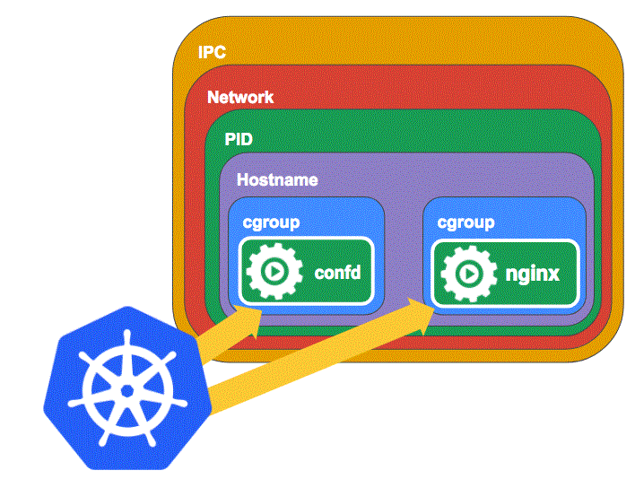
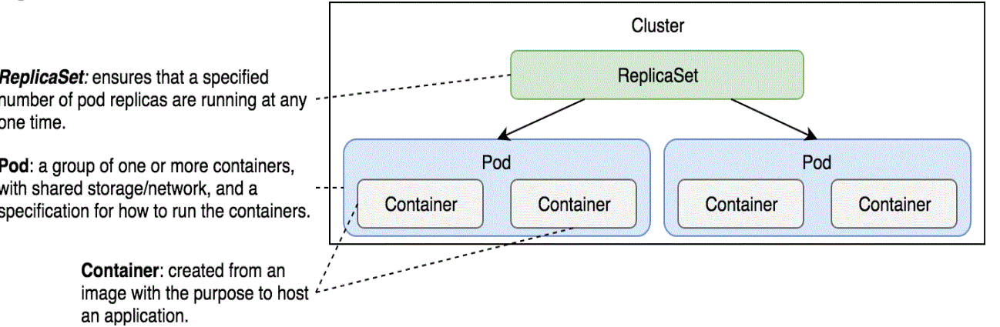
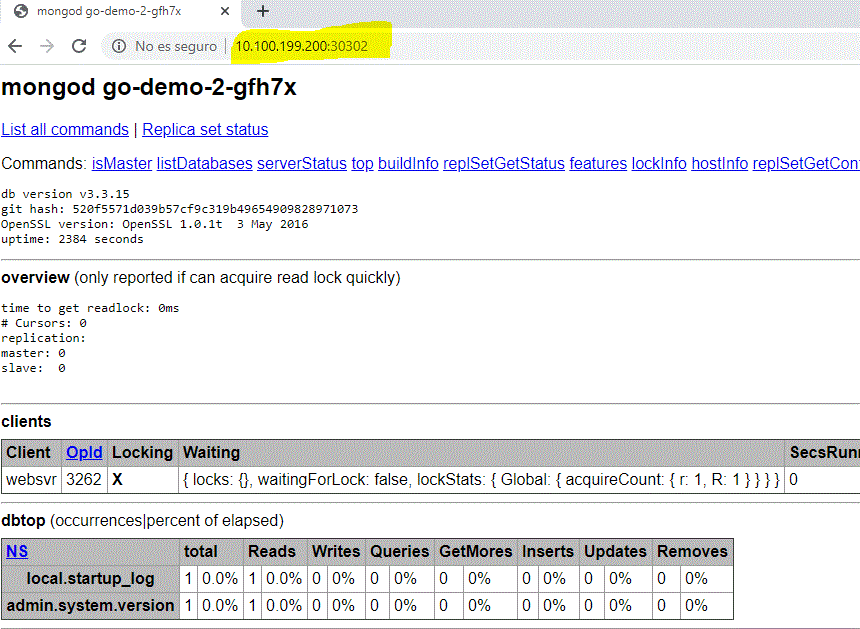
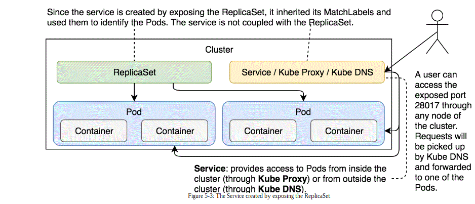
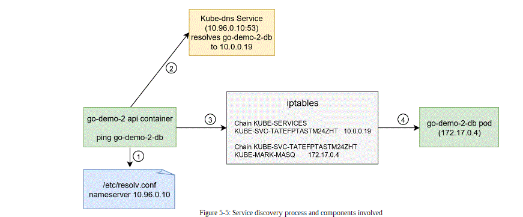

Primero vamos a crear dos pods de un mismo sistema. El sistema esta compuesto por un contenedor que implementa un [API REST](https://github.com/vfarcic/go-demo-2/blob/master/Dockerfile) y otro contenedor que contiene la BBDD. Al crear el sistema tendremos duplicados cada contenedor en dos PODS.  Podemos entender un POD como un amaquina virtual con un DockerEngine, el cual permite crear instancias de contenedores con conexion entre ellos, en este caso cada API y DB de cada POD. A continuacion tenemos los comandos que generan e inspeciconan el sistema. 

```bash
sudo minikube start --vm-driver=none
kubectl config current-context
kubectl get pods
kubectl get pods --all-namespaces
kubectl get all --all-namespaces
kubectl create -f k8spec/rs/go-demo-2.yml
```

La salida que se debe de obtener es la creacion de dos pods, teniendo en cada una de ellas dos contenedores.

```bash
kubectl get pods -o wide
NAME              READY   STATUS    RESTARTS   AGE   IP           NODE       NOMINATED NODE   READINESS GATES
go-demo-2-qh6b6   2/2     Running   0          20m   172.17.0.6   minikube   <none>           <none>
go-demo-2-zvrvm   2/2     Running   0          20m   172.17.0.7   minikube   <none>           <none>
```

Si analizamos los contenedores que hemos creado vemos que existen seis, tres por POD. Por POD tenemos un API REST , una BBDD y el ultimo de denomina 'pause'. Esta imagen se utiliza en el concepto de Pods en K8s. Un POD es un namespace y cgroup que se compoarte entre los contendores. El namespace son los diferentes recursos que utiliza un contenedor, por ejemplo IP/Network , IPC, Volumen , PID de procesos y etc. El cgroup permite gestionar los permisos. Normalmente en Docker los contendores , por defecto , no comparten namespace , pero se puede hacer. De esta manera podemos hacer que varios contenedores se ejecuten sobre la misma IP y sistema de procesos (PID),  pudiendose enviar señales tipo SIGKILL, SIGTERM entre ellas. Para crear este tipo de sistemas es necesasaio tener un contenedor padre que crea el namespace y Cgroup por defecto del POD, y ese es el contenedor PAUSE. Este contenedor ademas se encarga de que no haya procesos/contendores zombies y ademas de estar en pause constantemente , espera la finalizacion de los procesos hijos de sus contenedores hijos, y asi no habra zombies. Para conocer en mayor detalle la base de los PODS teneis los siguientes dos links:
1) [PODS](https://www.ianlewis.org/en/what-are-kubernetes-pods-anyway) 2) [Conetendor PAUSE y PODS](https://www.ianlewis.org/en/almighty-pause-container). En la sigueinte imagen podeis ver un esquema del concpeto POD.


```bash
docker ps --filter "name=go-demo*"
CONTAINER ID    IMAGE                  COMMAND  PORTS                    NAMES
5aa2ce3a762f   vfarcic/go-demo-2       "go-demo"                       k8s_api_go-demo-2-zvrvm_default_240241b6-f3ef-4de9-872d-6292d4efd5e1_0
23ebc6993cad   vfarcic/go-demo-2       "go-demo"                       k8s_api_go-demo-2-qh6b6_default_79d25c71-b967-43ac-8544-336d11521411_0
7ab2d84cbae6   3abda4f46443            "/entrypoint.sh mo..."          k8s_db_go-demo-2-zvrvm_default_240241b6-f3ef-4de9-872d-6292d4efd5e1_0
844f526d5258   3abda4f46443            "/entrypoint.sh mo..."          k8s_db_go-demo-2-qh6b6_default_79d25c71-b967-43ac-8544-336d11521411_0
bc131578db0f   k8s.gcr.io/pause:3.1    "/pause"                        k8s_POD_go-demo-2-zvrvm_default_240241b6-f3ef-4de9-872d-6292d4efd5e1_0
ab8530dae4a0   k8s.gcr.io/pause:3.1    "/pause"                        k8s_POD_go-demo-2-qh6b6_default_79d25c71-b967-43ac-8544-336d11521411_0
```


Una vez creados mediante el concepto de REPLICAS_SET de k8s dos pods , vamos a acceder a ellos. Mediante el comando *kubectl get pods -o wide* hemos obtenido las IP de los dos namespaces/POD creados: 1) **172.17.0.6** 2)**172.17.0.7**, siendo la IUP  de la  maquina NODO (la maquina VAGRANT en este caso) 10.100.199.200 y teniendo esta IP docker **172.17.0.1**, esta informacion la obteneis al ejecutar ifconfig en la maquina Vagrant.

```bash
$ curl 172.17.0.6:8080/demo/hello
hello, world!
$ curl 172.17.0.7:8080/demo/hello
hello, world!
```

Por lo tanto ejecutando *curl* desde una maquina que se ubique en la misma red que los PODS podemos acceder al API REST. Pero estos no estan expuestos al exterior como lo hacemos con el comando -p de docker o con PORTS de docker-compose. Si hicieramos *curl 127.0.0.1:8080/demo/hello* desde la maquina vagrant el resultado sería de error, porque a cual de los dos PODS nos queremos conectar? Aun no hemos asociado nada, solo hemos ejecutado los contenedores. Ahora es donde entra en juego el concepto de Servicios K8s.

```
$ curl 127.0.0.1:8080/demo/hello
curl: (7) Failed to connect to 127.0.0.1 port 8080: Connection refused
vagrant@ubuntu-xenial:/vagrant/ci_cd/ariketa_cd$ curl 10.100.199.200:8080/demo/hello
curl: (7) Failed to connect to 10.100.199.200 port 8080: Connection refused
vagrant@ubuntu-xenial:/vagrant/ci_cd/ariketa_cd$ curl 10.0.2.15:8080/demo/hello
curl: (7) Failed to connect to 10.0.2.15 port 8080: Connection refused
```

Mediante el concepto de pods y replicas podemos ejecutar contenedores  y k8s se encarga de rearrancarlos cada vez que se paran , y se encarga de escalarlos si asi se lo indicamos (ver  siguiente comando bash). Pero para acceder a los contendores debemos de estar en la misma red docker y ademas conocer las IPs. 

Por ejemplo vamos a subir el numero de pods a 4 mediante la especificacion de replicas del fichero *k8spec/rs/go-demo-2-scaled.yml*.

```bash
$ kubectl apply -f k8spec/rs/go-demo-2-scaled.yml
Warning: kubectl apply should be used on resource created by either kubectl create --save-config or kubectl apply
replicaset.apps/go-demo-2 configured
```
```bash
$ kubectl get pods
NAME              READY   STATUS    RESTARTS   AGE
go-demo-2-qh6b6   2/2     Running   0          4h26m
go-demo-2-qvmg4   2/2     Running   0          13s
go-demo-2-w45br   2/2     Running   0          13s
go-demo-2-zvrvm   2/2     Running   0          4h26m
```
Ahora vemos como tenemos cuatro replicas. Pero la IP de despliegue del POD la decide k8s y no podemos acceder desde fuera a nuestra API :-( Ahora mismo lo que tenemos lo resume la siguiente imagen.



Por lo tanto resumiendo podemos decir lo siguiente sobre los PODS: Los PODS son la unidad mas pequeña en k8s. Estos son creados y destruidos. Esto no se recuperan, el sistema crea un nuevo POD para recuperarse de errores, el sistema es duradero pero no los PODs. Los controladores junto con los Schedulers se asegran de que los PODs estan correctamente. El controlador del tipo ReplicaSet se asegura de que siempre haya el numero de PODs requerido en ejecución. El problema es que no hay comunicacion entre los PODs , solo los contenedores dentro de los PODs pueden hablar entre ellos a traves de la direccion localhost, por eso en este ejemplo tanto la BD como el API estan en el mismo POD. Si conocemos la IP de los PODs podemos comunicar diferentes contenedores en diferentes PODs pero cuando se destruya una replica y se genera otra no sabremos de antemano la IP del POD. Los servicios K8s dan salida a este problema. Vayamos a trabajar con servicios ahora.Primero eliminamos lo realziado hasta ahora.
 
```bash
$ kubectl delete -f k8spec/rs/go-demo-2-scaled.yml
replicaset.apps "go-demo-2" deleted
 ```

 Ahora creamos otra vez una replica con dos PODs equivalente al anterior con la diferencia de que activamos la interface HTTP del mongodb.

```bash
$ kubectl create -f k8spec/svc/go-demo-2-rs.yml
replicaset.apps/go-demo-2 created
$ kubectl get pods
NAME              READY   STATUS    RESTARTS   AGE
go-demo-2-gfh7x   2/2     Running   0          32s
go-demo-2-wsk75   2/2     Running   0          32s
 ```

Ahora mediante el comando EXPOSE de k8s crearemos un servicio que expone un recurso k8s, por ejemplo una replica o un pod. Con el siguiente comando exponemos la replica creada;-)

```bash
$kubectl create -f k8spec/svc/go-demo-2-svc.yml
$kubectl expose rs go-demo-2 \
>     --name=go-demo-2-svc \
>     --target-port=28017 \
>     --type=NodePort
service/go-demo-2-svc exposed
```

En este caso estamos exponiendo el puerto de mongo en todos los nodos y hacia el exterior. En esta caso el servicio es del tipo *NodePort*, pero existen otros tipos:

- ClusterIp : Solo expone el puerto dentro del cluster. Utilizado para ccrear comunicaciones internas del cluster
- Load Balancer
- External Service

Para crear servicios k8s utiliza un servicio interno de DNS y un Proxy. El proceso de creacion de servicio es el siguiente

1. kubectl requiere un nuevo servicio mediante el comando expose relacionado con los PODs de una replica_set
2. Se crea un objeto servicio  con el nombre requerido para dar respuesta a la peticion y detecta las IP de los PODs requeridos.
3. kube-proxy detecta la creacion del servicio junto con la informacion de las IP de los PODS y crea una regla en el IPTABLES que permrite enrutar el trafico a los PODs. Se crea un aregla por POD
4. El DNS de k8s dteceta que hay unnuevo servicio y agrega toda la informacion


Si ahora ejecutamos el comando de descripcion obtendremos toda la informacion generada en el cluster respectoa al servicio, siendo muy importante los endpoint agregados junto con el puerto.

```bash
$ kubectl describe svc go-demo-2
Name:                     go-demo-2-svc
Namespace:                default
Labels:                   <none>
Annotations:              <none>
Selector:                 service=go-demo-2,type=backend
Type:                     NodePort
IP:                       10.96.112.156
Port:                     <unset>  28017/TCP
TargetPort:               28017/TCP
NodePort:                 <unset>  30302/TCP
Endpoints:                172.17.0.6:28017,172.17.0.7:28017
Session Affinity:         None
External Traffic Policy:  Cluster
Events:                   <none>
```

Utilizando la ip y el NodePort podemos acceder a los PODs aleatoriamente.

```bash
$ curl 10.100.199.200:30302
<html><head>
<title>mongod go-demo-2-wsk75</title>
<style type="text/css" media="screen">body { font-family: helvetica, arial, san-serif }
```
Y desde el navegador utilizando la ip que expone el Vagrant hacia el exterior. Si llamamos varias veces veremos como el proxy de k8s va variando entre el POD.




La estructura que utiliza k8s respecto a la exposicion de Replicas mediante servicios sería la siguiente



El comando para eliminar el servicio sería el siguiente:

```bash
kubectl delete svc go-demo-2-svc
```

En este caso hemos creado el servicio de una forma imperativa, mediante un comando. A continuación se presenta el fichero descriptivo *yaml* que crearia el servicio. Para ello creaemos mediante un fichero el servicio del Backend.

```yaml
apiVersion: v1
kind: Service
metadata:
  name: go-demo-2-api
spec:
  type: NodePort
  ports:
  - port: 8080
  selector:
    type: api
    service: go-demo-2
```

```bash
$ kubectl create -f k8spec/svc/go-demo-2-api-svc-froga.yml
service/go-demo-2-api created
$ kubectl describe  svc go-demo-2-api
Name:                     go-demo-2-api
Namespace:                default
Labels:                   <none>
Annotations:              <none>
Selector:                 service=go-demo-2,type=backend
Type:                     NodePort
IP:                       10.96.172.235
Port:                     <unset>  8080/TCP
TargetPort:               8080/TCP
NodePort:                 <unset>  31188/TCP
Endpoints:                172.17.0.6:8080,172.17.0.7:8080
Session Affinity:         None
External Traffic Policy:  Cluster
Events:                   <none>
$ curl 127.0.0.1:31188/demo/hello
hello, world!
$ curl 10.100.199.200:31188/demo/hello
hello, world!
```
declarativamente es muy facil forzar el puerto del servicio a exponer.

```yaml
apiVersion: v1
kind: Service
metadata:
  name: go-demo-2-api
spec:
  type: NodePort
  ports:
  - port: 8080
    nodeport: 30080
    protocol: tcp
  selector:
    type: api
    service: go-demo-2
```

```bash
$ kubectl apply -f k8spec/svc/go-demo-2-api-svc-froga-nodeport.yml
Warning: kubectl apply should be used on resource created by either kubectl create --save-config or kubectl apply
service/go-demo-2-api configured
$ curl 10.100.199.200:30080/demo/hello
hello, world!
```

Y ahora para ver los datos del servicio 

```bash
$ kubectl get svc
NAME            TYPE        CLUSTER-IP      EXTERNAL-IP   PORT(S)           AGE
go-demo-2-api   NodePort    10.96.172.235   <none>        8080:30080/TCP    60m
go-demo-2-svc   NodePort    10.96.112.156   <none>        28017:30302/TCP   4h2m
kubernetes      ClusterIP   10.96.0.1       <none>        443/TCP           9h
$ kubectl get svc go-demo-2-api
NAME            TYPE       CLUSTER-IP      EXTERNAL-IP   PORT(S)          AGE
go-demo-2-api   NodePort   10.96.172.235   <none>        8080:30080/TCP   60m
```

Un dato importante son los endpoints asociados a un servicio , esto lo podemos ver con el comando *kubectl describe svc go-demo-2-api*. Tambien podemos ver solo la informacion de los endppoitns con el siguiente comando:

```bash
$ kubectl get ep go-demo-2-api -o yaml
apiVersion: v1
kind: Endpoints
metadata:
  annotations:
    endpoints.kubernetes.io/last-change-trigger-time: "2020-04-17T19:05:07Z"
  creationTimestamp: "2020-04-17T19:05:07Z"
  name: go-demo-2-api
  namespace: default
  resourceVersion: "64594"
  selfLink: /api/v1/namespaces/default/endpoints/go-demo-2-api
  uid: 9fda71f2-2249-42b3-bdbd-bec4e8596943
subsets:
- addresses:
  - ip: 172.17.0.6
    nodeName: minikube
    targetRef:
      kind: Pod
      name: go-demo-2-wsk75
      namespace: default
      resourceVersion: "41017"
      uid: 4b1fdc63-8174-4efe-8e50-c797f9a1a2f2
  - ip: 172.17.0.7
    nodeName: minikube
    targetRef:
      kind: Pod
      name: go-demo-2-gfh7x
      namespace: default
      resourceVersion: "41026"
      uid: 45ed3866-fde9-479c-ad79-cf78ff59068d
  ports:
  - port: 8080
    protocol: TCP

```

Hasta ahora hemos visto como crear una comunicacion hacia el exterior en un k8s, ahora vamos a mejorar la aqruitectura del sistema poniendo la BBDD en un REPLICA_SET/POD y el API en otro y crearemos un servicio de cluster para comunicar los PODS. Para ello crearemos primero las replicas de forma declarativa y luego los servicios.


```bash
kubectl create -f k8spec/svc/go-demo-2-db-rs.yml
kubectl create -f k8spec/svc/go-demo-2-api-rs.yml
```

Ahora vamos con los servicios, primero el de la base de datos mediante **kubectl create -f k8spec/svc/go-demo-2-db-svc.yml** y luego del API **kubectl create -f k8spec/svc/go-demo-2-api-svc-v2.yml** 

```bash
$ kubectl get svc
NAME               TYPE        CLUSTER-IP      EXTERNAL-IP   PORT(S)           AGE
go-demo-2-api      NodePort    10.96.172.235   <none>        8080:30080/TCP    85m
go-demo-2-api-v2   NodePort    10.96.19.214    <none>        8080:30681/TCP    9s
go-demo-2-db       ClusterIP   10.96.116.11    <none>        27017/TCP         39s
go-demo-2-svc      NodePort    10.96.112.156   <none>        28017:30302/TCP   4h28m
kubernetes         ClusterIP   10.96.0.1       <none>        443/TCP           9h
```

Fijaros que el servicio *go-demo-2-db* es delt tipo *clusterIP*, mientras que el *go-demo-2-api-v2* es del tipo *nodeport*. Ahora realizaremos una peticion al servicio API-v2. Para que todo funcione es importante ver que en la descripcion de la  replica_set de la base de datos como URL de la BBDD hemos puesto el nombre del servicio *go-demo-2-db*.

```bash
$ curl -i  127.0.0.1:30681/demo/hello
HTTP/1.1 200 OK
Date: Fri, 17 Apr 2020 20:35:25 GMT
Content-Length: 14
Content-Type: text/plain; charset=utf-8

hello, world!
```

Una vez visto los servicios y antes de seguir elimnaremos lo creado.

```bash
kubectl delete -f k8spec/svc/go-demo-2-db-svc.yml
kubectl delete -f k8spec/svc/go-demo-2-api-svc-v2.yml
kubectl delete -f k8spec/svc/go-demo-2-db-rs.yml
kubectl delete  -f k8spec/svc/go-demo-2-api-rs.yml
kubectl delete svc go-demo-2-api
service "go-demo-2-api" deleted
kubectl delete svc go-demo-2-svc
service "go-demo-2-svc" deleted
kubectl get rs
NAME        DESIRED   CURRENT   READY   AGE
go-demo-2   2         2         2       4h43m
kubectl delete rs go-demo-2
replicaset.apps "go-demo-2" deleted
kubectl get pod
NAME              READY   STATUS        RESTARTS   AGE
go-demo-2-gfh7x   0/2     Terminating   0          4h43m
go-demo-2-wsk75   0/2     Terminating   0          4h43m
``` 

Es importante recordar que en este ultimo ejemplo hemos utilizado varios ficheros para definir todos los elementos, pero para facilitar el mantenimiento es posible definir todo el  sistema en un unico fichero. En el fichero **k8spec/svc/go-demo-2.yml** teneis la combiacion de todos los ficheros en uno. De esta manera con un unico comando podreis cargar todo el sistema ;-) **kubectl create -f k8spec/svc/go-demo-2.yml** y ver lo creado **kubectl get -f k8spec/svc/go-demo-2.yml**.

 ```bash
$ kubectl create -f k8spec/svc/go-demo-2.yml
replicaset.apps/go-demo-2-db created
service/go-demo-2-db created
replicaset.apps/go-demo-2-api created
service/go-demo-2-api created
$ kubectl get -f k8spec/svc/go-demo-2.yml
NAME                           DESIRED   CURRENT   READY   AGE
replicaset.apps/go-demo-2-db   1         1         1       7s

NAME                   TYPE        CLUSTER-IP    EXTERNAL-IP   PORT(S)     AGE
service/go-demo-2-db   ClusterIP   10.96.97.83   <none>        27017/TCP   7s

NAME                            DESIRED   CURRENT   READY   AGE
replicaset.apps/go-demo-2-api   3         3         2       7s

NAME                    TYPE       CLUSTER-IP     EXTERNAL-IP   PORT(S)          AGE
service/go-demo-2-api   NodePort   10.96.78.255   <none>        8080:31341/TCP   7s
$ curl 127.0.0.1:31341/demo/hello
hello, world!
 ```

 Una vez recreado en el sistema vamos a ver las variables de entorno de cada contenedor/pod para ver como se consigue acceder entre los servicios. Para ello utilizando el nombre de primer POD del API ejecutaremos el comando env sobre el.

 ```bash
 POD_NAME=$(kubectl get pod \
    --no-headers \
    -o=custom-columns=NAME:.metadata.name \
    -l type=api,service=go-demo-2 \
    | tail -1)
echo $POD_NAME
go-demo-2-api-z8ggx
kubectl exec $POD_NAME env
PATH=/usr/local/sbin:/usr/local/bin:/usr/sbin:/usr/bin:/sbin:/bin
HOSTNAME=go-demo-2-api-z8ggx
DB=go-demo-2-db
GO_DEMO_2_DB_PORT=tcp://10.96.97.83:27017
GO_DEMO_2_DB_PORT_27017_TCP_ADDR=10.96.97.83
GO_DEMO_2_API_SERVICE_HOST=10.96.78.255
GO_DEMO_2_API_SERVICE_PORT=8080
GO_DEMO_2_API_PORT_8080_TCP_ADDR=10.96.78.255
GO_DEMO_2_API_PORT=tcp://10.96.78.255:8080
GO_DEMO_2_API_PORT_8080_TCP=tcp://10.96.78.255:8080
```

Para establecer estos valores se utiliza el nombre del servicio alojado en el DNS. Todo esto se puede validar mirando la descripcion del servicio y luego la especificación de las variables de entorno de los contenedores a lanzar en los PODs. El proceso de descubrimiento seria el siguiente, suponer que partiriamos del siguiente comando *kubectl exec <POD-NAME> -c <CONTAINER-NAME> -- <COMMAND>*

```bash
kubectl exec -it  go-demo-2-api-z8ggx  -- /bin/sh
wget   go-demo-2-api:8080/demo/hello
Connecting to go-demo-2-api:8080 (10.96.78.255:8080)
hello                100% |*************************************************************************|    14   0:00:00 ETA / # ls
bin      etc      home     lib64    media    proc     run      srv      tmp      var
dev      hello    lib      linuxrc  mnt      root     sbin     sys      usr
/ # cat hello
hello, world!
/ #
```


En cambio desde fuera podemos utilizar el nombre del servicio? porque?

```bash
 wget go-demo-2-api
--2020-04-17 21:16:26--  http://go-demo-2-api/
Resolving go-demo-2-api (go-demo-2-api)... failed: Name or service not known.
wget: unable to resolve host address ‘go-demo-2-api’
```
