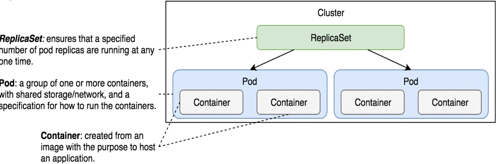

##  K8S: Basic concepts

En este primer apartado se trabajaran los conceptos basicos:

- Puesta en marcha de cluster minikube
- Pods
    - Single-contianer per pod
    - Multiple-container per pod
    - Monitoring health
- ReplicaSets

### Instalacion  y puesta en marhca

Tenemos dos entornos : Local vs Cloud

### Local  

Para la creacion en local de un cluster de Kubernetes podriamos crear 4 maquinas vagrant para constituir el cluster. Para facilitar los pasos iniciales podemos empezar con un cluster de una sola  maquina emulada mediante minikube (single-node cluster). Mediante minikube se puede practicar con un cluster kubernetes utilizando una sola maquina. 

Kubectl nos permite gestionar un k8s desde el CLI. Para instalar kubectl en un linux, por ejemplo en la configuracion Basic de vagrant, ejecutar lo siguiente:

```bash
curl -LO https://storage.googleapis.com/kubernetes-release/release/`curl -s https://storage.googleapis.com/kubernetes-release/release/stable.txt`/bin/linux/amd64/kubectl
chmod +x ./kubectl
sudo mv ./kubectl /usr/local/bin/kubectl
kubectl version

Client Version: version.Info{Major:"1", Minor:"17", GitVersion:"v1.17.0", GitCommit:"70132b0f130acc0bed193d9ba59dd186f0e634cf", GitTreeState:"clean", BuildDate:"2019-12-07T21:20:10Z", GoVersion:"go1.13.4", Compiler:"gc", Platform:"linux/amd64"}
The connection to the server localhost:8080 was refused - did you specify the right host or port?
    
```

Para instalar minikube en la configuracion de Basic de Vagrant.

```bash
curl -LO https://storage.googleapis.com/minikube/releases/latest/minikube-linux-amd64 \
   && sudo install minikube-linux-amd64 /usr/local/bin/minikube
sudo apt-get install -y conntrack 
sudo minikube start --vm-driver=none
kubectl proxy --address 0.0.0.0 --accept-hosts '.*'

minikube dashboard
```

Minikube normalmente crea una  maquna virtual con docker sobre la cual ejecuta todos sus comandos. Para ello es necesario configurar las variables de entorno docker para que interactuen directamente con el cluster y no con el docker local. Para configurar el entorno correctamente se utiliza el siguiente comando *(no ejecutar con vagrant)*.

```bash
minikube docker-env
export DOCKER_TLS_VERIFY="1"
export DOCKER_HOST="tcp://192.168.99.100:2376"
export DOCKER_CERT_PATH="/Users/vfarcic/.minikube/certs"
export DOCKER_API_VERSION="1.23"
# Run this command to configure your shell:
# eval $(minikube docker-env)
```

En nuestro caso como estamos trabajando con una maquina virtual vagrant estamos utilizando --vm-driver=none y por lo tanto esta configuracion no es necesaria porque interactuamos directamente con el docker engine.

Una vez lanzado minikube podemos analizar los contenedores activos, y vemos como se han generado una serie de contenedores k8s. Estos contenedores son necesarios para todo cluster kubernetes.

```bash
docker ps --format '{{.Names}}'
k8s_coredns_coredns-6955765f44-68n96_kube-system_6f10ff76-abf4-4e6e-90f4-7c06e325dd55_3
k8s_kube-proxy_kube-proxy-lq9zq_kube-system_ed29d7eb-fcb2-426b-9d33-e61150b77bf7_4
k8s_storage-provisioner_storage-provisioner_kube-system_cbc3c05e-e694-4c38-8d23-b992b8fbbbed_6k8s_POD_coredns-6955765f44-68n96_kube-system_6f10ff76-abf4-4e6e-90f4-7c06e325dd55_3
k8s_POD_coredns-6955765f44-lj795_kube-system_c3cf7257-68ee-4011-8362-95da17cad122_3
k8s_POD_storage-provisioner_kube-system_cbc3c05e-e694-4c38-8d23-b992b8fbbbed_4
k8s_POD_kube-proxy-lq9zq_kube-system_ed29d7eb-fcb2-426b-9d33-e61150b77bf7_4
k8s_POD_dashboard-metrics-scraper-7b64584c5c-xstj9_kubernetes-dashboard_9e5f3f79-12f4-4989-aee7-c86d86916479_4
k8s_POD_kubernetes-dashboard-79d9cd965-ffs5r_kubernetes-dashboard_5c46646c-bf5d-439c-a576-cd393d42f322_4
k8s_kube-controller-manager_kube-controller-manager-minikube_kube-system_e8d818766f308c86d81e7d43e546866d_6
k8s_kube-apiserver_kube-apiserver-minikube_kube-system_e35f70c92999e62f71d61f87ed1871b5_4
k8s_kube-addon-manager_kube-addon-manager-minikube_kube-system_c3e29047da86ce6690916750ab69c40b_4
k8s_etcd_etcd-minikube_kube-system_9e753ec4e10e54ddc4271933b98f8295_4
k8s_kube-scheduler_kube-scheduler-minikube_kube-system_ff67867321338ffd885039e188f6b424_6
k8s_POD_kube-controller-manager-minikube_kube-system_e8d818766f308c86d81e7d43e546866d_4
k8s_POD_kube-apiserver-minikube_kube-system_e35f70c92999e62f71d61f87ed1871b5_4
k8s_POD_kube-addon-manager-minikube_kube-system_c3e29047da86ce6690916750ab69c40b_4
k8s_POD_etcd-minikube_kube-system_9e753ec4e10e54ddc4271933b98f8295_4
k8s_POD_kube-scheduler-minikube_kube-system_ff67867321338ffd885039e188f6b424_
```

La siguiente configuracion es comprobar con que cluster esta configurado el cliente kubectl y para ello ejecutamos el siguiente comando. Al inidcar *minikube* significa que el cliente esta hablando con el kuberntes que ha creado minikube;-)

```bash
kubectl config current-context
minikube
```

El siguiente paso es ver los nodos que tenemos. En nuestro caso solo tenemos uno.

```bash
kubectl get nodes
NAME       STATUS   ROLES    AGE   VERSION
minikube   Ready    master   61d   v1.17.0
```
Si ahora queremos ver todos los contendedores que constituyen el cluster con sus servicios ejecutamos el siguiente comando.

```bash
kubectl get all --all-namespaces
NAMESPACE              NAME                                             READY   STATUS    RESTARTS   AGE
kube-system            pod/coredns-6955765f44-68n96                     1/1     Running   3          61d
kube-system            pod/coredns-6955765f44-lj795                     1/1     Running   3          60d
kube-system            pod/etcd-minikube                                1/1     Running   4          61d
kube-system            pod/kube-addon-manager-minikube                  1/1     Running   4          61d
kube-system            pod/kube-apiserver-minikube                      1/1     Running   4          61d
kube-system            pod/kube-controller-manager-minikube             1/1     Running   6          61d
kube-system            pod/kube-proxy-lq9zq                             1/1     Running   4          61d
kube-system            pod/kube-scheduler-minikube                      1/1     Running   6          61d
kube-system            pod/storage-provisioner                          1/1     Running   6          61d
kubernetes-dashboard   pod/dashboard-metrics-scraper-7b64584c5c-xstj9   1/1     Running   4          61d
kubernetes-dashboard   pod/kubernetes-dashboard-79d9cd965-ffs5r         1/1     Running   8          61d

NAMESPACE              NAME                                TYPE        CLUSTER-IP      EXTERNAL-IP   PORT(S)                  AGE
default                service/kubernetes                  ClusterIP   10.96.0.1       <none>        443/TCP                  61d
kube-system            service/kube-dns                    ClusterIP   10.96.0.10      <none>        53/UDP,53/TCP,9153/TCP   61d
kubernetes-dashboard   service/dashboard-metrics-scraper   ClusterIP   10.96.140.199   <none>        8000/TCP                 61d
kubernetes-dashboard   service/kubernetes-dashboard        ClusterIP   10.96.94.26     <none>        80/TCP                   61d

NAMESPACE     NAME                        DESIRED   CURRENT   READY   UP-TO-DATE   AVAILABLE   NODE SELECTOR                 AGE
kube-system   daemonset.apps/kube-proxy   1         1         1       1            1           beta.kubernetes.io/os=linux   61d

NAMESPACE              NAME                                        READY   UP-TO-DATE   AVAILABLE   AGE
kube-system            deployment.apps/coredns                     2/2     2            2           61d
kubernetes-dashboard   deployment.apps/dashboard-metrics-scraper   1/1     1            1           61d
kubernetes-dashboard   deployment.apps/kubernetes-dashboard        1/1     1            1           61d

NAMESPACE              NAME                                                   DESIRED   CURRENT   READY   AGE
kube-system            replicaset.apps/coredns-6955765f44                     2         2         2       61d
kube-system            replicaset.apps/coredns-7f85fdfc6b                     0         0         0       61d
kubernetes-dashboard   replicaset.apps/dashboard-metrics-scraper-7b64584c5c   1         1         1       61d
kubernetes-dashboard   replicaset.apps/kubernetes-dashboard-79d9cd965         1         1         1       61d
```

Ahora podemos parar , arrancar o incluso eliminar el Cluster kubernetes Minikube.


#### Utilizando Pods

El Pod es la minima unidad de ejecución en Kubernetes. En un Pod se pueden ejecutar varios contenedores, aunque el patrón mas habitual es el modelo un contenedor por pod. Un Pod es un envoltorio sobre un contenedor.

Un Pod se define de la siguiente manera de forma descriptiva en un yaml y se utiliza el comando *kubectl create -f*  para crear el pod.

```yaml
apiVersion: v1
kind: Pod

metadata: 
    name: db
    labels: 
        type: db
        vendor: Mongolabs
spec:
    containers:
    - name: db
      image: mongo:3.3
      command: ["mongod"]
      args: ["--rest" , "--httpinterface"]
```

```bash
kubectl create -f k8spec/db.yml
pod/db created
kubectl get pods -o wide
NAME   READY   STATUS    RESTARTS   AGE   IP           NODE       NOMINATED NODE   READINESS GATES
db     1/1     Running   0          16m   172.17.0.4   minikube   <none>           <none>
kubectl get pods -o yaml
apiVersion: v1
items:
- apiVersion: v1
  kind: Pod
  metadata:
    creationTimestamp: "2020-03-09T13:52:15Z"
    labels:
      type: db
      vendor: Mongolabs
    name: db
    namespace: default
    resourceVersion: "139563"
    selfLink: /api/v1/namespaces/default/pods/db
    uid: 61594cc4-5a38-4b83-96e4-2a34e40fbcd0
  spec:
    containers:
    - args:
      - --rest
      - --httpinterface
      command:
      - mongod
      image: mongo:3.3
      imagePullPolicy: IfNotPresent
      name: db
      resources: {}
      terminationMessagePath: /dev/termination-log
      terminationMessagePolicy: File
      volumeMounts:
      - mountPath: /var/run/secrets/kubernetes.io/serviceaccount
        name: default-token-jdtxb
        readOnly: true
    dnsPolicy: ClusterFirst
kubectl get pods -o json
kubectl describe pods
kubectl describe -f k8spec/db.yml
```

Al ejecutar el comando *kubectl create -f k8spec/db.yaml* se realiza el siguiente proceso.


Como en docker, en Kubernetes tambien podemos ejecutar/lanzar un nuevo proceso en un contenedor dentro de un Pod. Para esto se utiliza la opcion *exec*

```bash
kubectl exec db ps aux
USER       PID %CPU %MEM    VSZ   RSS TTY      STAT START   TIME COMMAND
root         1  0.8  2.9 290556 59712 ?        Ssl  13:52   0:21 mongod --rest --httpinterface
root        23  0.0  0.1  17496  2076 ?        Rs   14:32   0:00 ps aux
```

Tambien existe la posibilidad de entrar de forma interactiva con las opciones *-it*.

```bash
kubectl exec db -it sh
# pwd
/
# exit
kubectl logs db
020-03-09T13:52:18.430+0000 I INDEX    [initandlisten] build index done.  scanned 0 total records. 0 secs
2020-03-09T13:52:18.431+0000 I NETWORK  [thread1] waiting for connections on port 27017
2020-03-09T14:25:44.237+0000 I COMMAND  [ftdc] serverStatus was very slow: { after basic: 0, after asserts: 0, after backgroundFlushing: 0, after connections: 0, after dur: 0, after extra_info: 0, after globalLock: 0, after locks: 0, after network: 0, after opLatencies: 0, after opcounters: 0, after opcountersRepl: 0, after repl: 0, after security: 0, after sharding: 0, after storageEngine: 0, after tcmalloc: 0, after wiredTiger: 0, at end: 1343 }
```

El concepto ofrece mecanismos de autoreparacion para sus contenedores. Que ocurre cuando la aplicacion lanzada en el contenedor termina su ejecucion. Por ejemplo si matamos al servidor mongo y miramos el estado de los pods vemos el contenedor ha tenido un reinicio.


```bash
kubectl get pods
NAME   READY   STATUS    RESTARTS   AGE
db     1/1     Running   0          45m
kubectl exec -it db pkill mongod
kubectl get pods
NAME   READY   STATUS    RESTARTS   AGE
db     1/1     Running   1          45m
```


Para fnalizar un Pod se ejecuta la opcion delete. 

```bash
kubectl delete -f k8spec/db.yml
pod "db" deleted
kubectl get pods
No resources found in default namespace.
```


A pesar de que lo mas habitual es ejecutar un contenedor por Pod es posible ejecutar mas de un contenedor. En el siguiente fichero tenemos el servidor mongo junto con una aplicacion go (go-demo-2.yml).

```yaml
apiVersion: v1
kind: Pod
metadata:
    name: go-demo2
    labels: 
        type: stack
spec:
    containers:
    - name: db
      image: mongo:3.3
    - name: api
      image: vfarcic/go-demo-2
      env:
      - name: db
        value: localhost
```  

Ahora podemos lanzar los pods y ver su informacion.

```bash
kubectl create -f k8spec/go-demo-2.yml
kubectl get pods
NAME       READY   STATUS             RESTARTS   AGE
go-demo2   1/2     CrashLoopBackOff   4          3m8s
kubectl get -f k8spec/go-demo-2.yml
kubectl get -f k8spec/go-demo-2.yml \
    -o jsonpath="{.spec.containers[*].name}"
db api

```

Para ejecutar el contenedor de un pod multicontainer el comando es el siguiente

```bash
kubectl exec -it -c db go-demo2 ps aux
USER       PID %CPU %MEM    VSZ   RSS TTY      STAT START   TIME COMMAND
mongodb      1  0.8  2.8 269692 58424 ?        Ssl  15:12   0:03 mongod
root        28  0.0  0.1  17496  2056 ?        Rs+  15:19   0:00 ps aux
```

Para los logs es algo parecido

```bash
kubectl logs go-demo2 -c db
```

A continuacion creamos otro pod donde duplicamso el servicio de APÌ los cuales hablan con la base de datos. Tenemos que entender un Pod , algo parecido a un docker-compose , donde todos los contenedores compoarten los mismos recursos. En el siguiente ejemplo tenemos 3 contenedores (para poner en marcha este pod, tenemos que borrar el anterior porque tienen el mismo nombre).

```yaml
apiVersion: v1
kind: Pod
metadata:
    name: go-demo2
    labels: 
      type: stack
spec:
    containers:
    - name: db
      image: mongo:3.3
    - name: api-1
      image: vfarcic/go-demo-2
      env:
      - name: DB
        value: localhost
    - name: api-2
      image: vfarcic/go-demo-2
      env:
      - name: DB
        value: localhost
```

El patron muticontainer pod no es un buen diseño.

Otra caracteristica que nos ofrece kubernetes es la verificación de salud de los contenedores. Para ello tenemos las siguientes opciones en los pods (go-demo-2-health.yml, para poner en marcha este pod, tenemos que borrar el anterior porque tienen el mismo nombre).

```yaml
  - name: api
    image: vfarcic/go-demo-2
    env:
    - name: DB
      value: localhost
    livenessProbe:
      httpGet:
        path: /this/path/does/not/exist
        port: 8080
      initialDelaySeconds: 5
      timeoutSeconds: 2 # Defaults to 1
      periodSeconds: 5 # Defaults to 10
      failureThreshold: 1 # Defaults to 3
```
```bash
kubectl create -f k8spec/go-demo-2-health.yml
kubectl describe -f k8spec/go-demo-2-health.yml
Events:
  Type     Reason     Age                 From               Message
  ----     ------     ----                ----               -------
  Normal   Scheduled  16m                 default-scheduler  Successfully assigned default/go-demo2 to minikube
  Normal   Pulled     16m                 kubelet, minikube  Container image "mongo:3.3" already present on machine
  Normal   Created    16m                 kubelet, minikube  Created container db
  Normal   Started    16m                 kubelet, minikube  Started container db
  Normal   Pulling    16m (x4 over 16m)   kubelet, minikube  Pulling image "vfarcic/go-demo-2"
  Warning  Unhealthy  16m (x3 over 16m)   kubelet, minikube  Liveness probe failed: HTTP probe failed with statuscode: 404
  Normal   Killing    16m (x3 over 16m)   kubelet, minikube  Container api failed liveness probe, will be restarted
  Normal   Pulled     16m (x4 over 16m)   kubelet, minikube  Successfully pulled image "vfarcic/go-demo-2"
  Normal   Created    16m (x4 over 16m)   kubelet, minikube  Created container api
  Normal   Started    16m (x4 over 16m)   kubelet, minikube  Started container api
  Warning  BackOff    79s (x69 over 15m)  kubelet, minikube  Back-off restarting failed container

``` 

En kubernetes lo habitual es no crear los pods manualmente , sino que los gestione el servicio, a pesar de que kubernetes intente tener siempre activo los contenedores de un pod , no se puede decir lo mismo sobre los pods. Si un pod es eliminado este no sera replanifificado en otro nodo. 

## Escalando Pods  mediante Replica Sets
Los Pods por si solos no son tolerantes a fallo. En cambio si son construidos con un controlador, por ejemplo ReplicaSets kubernetes se encarga de que estos pods persistan. 

Para especificar ReplicaSets el fichero yaml es parecido al de pods pero el tipo es ReplicaSets. El siguiente yaml es un ejemplo (k8spec/rs/go-demo-2.yml). Este yaml es bastante similar al de los pods. Comienza con *apiVersion*,*kind* y *metadata*. A conitnuacion tiene el apartado de *spec*.Y ya ahi podemos definir  *replicas* junto con sus filtros. Y luego se definen plantillas a la cual se le aplica self-healing.

```yaml

apiVersion: apps/v1
kind: ReplicaSet
metadata:
  name: go-demo-2
spec:
  replicas: 2
  selector:
    matchLabels:
      type: backend
      service: go-demo-2
  template:
    metadata:
      labels:
        type: backend
        service: go-demo-2
        db: mongo
        language: go
    spec:
      containers:
      - name: db
        image: mongo:3.3
      - name: api
        image: vfarcic/go-demo-2
        env:
        - name: DB
          value: localhost
        livenessProbe:
          httpGet:
            path: /demo/hello
            port: 8080
  #containers:

```


Ahora crearemos las replicas


```bash
kubectl create -f k8spec/rs/go-demo-2.yml
kubectl get pods
kubectl get rs
kubectl get -f k8spec/rs/go-demo-2.yml
kubectl describe -f k8spec/rs/go-demo-2.yml
kubectl get pods --show-labels
```


Para borrar las replicas tenemos la opcion de ejeuctar delete.


```bash
kubectl delete -f k8spec/rs/go-demo-2.yml --cascade=false
kuebctl get rs
kubectl get pods
kubectl create -f k8spec/rs/go-demo-2.yml \
    --save-config

```

Con estos comando vemos como hemos creado las replicas, despues hemos borrado las replicas pero no los pods. A continuacion hemos guardado la configuracion.

Ahora vamos a ejecutar una nueva configuracion de replicaset y escalando 4 el numero de pods (k8spec/rs/go-demo-2-scaled.yml).


```bash
kubectl apply -f k8spec/rs/go-demo-2-scaled.yml
```

```yaml
apiVersion: apps/v1
kind: ReplicaSet
metadata:
  name: go-demo-2
spec:
  replicas: 4
  selector:
    matchLabels:
      type: backend
      service: go-demo-2
  template:
    metadata:
      labels:
        type: backend
        service: go-demo-2
        db: mongo
        language: go
    spec:
      containers:
      - name: db
        image: mongo:3.3
      - name: api
        image: vfarcic/go-demo-2
        env:
        - name: DB
          value: localhost
        livenessProbe:
          httpGet:
            path: /demo/hello
            port: 8080

```

Que pasa ahora al hacer  *kubectl get pods* ?

Ahora vamos a borrar algun pod.

```bash
POD_NAME=$(kubectl get pods -o name  | tail -1)
echo $POD_NAME
kubectl delete $POD_NAME
```
Y al mirar que ocurre al borralo vemos que kubernetes a vuelto a crear otra replica.

Ahora en cambio si quitamos un label a uno de los pods veremos que ocurre.


```bash
POD_NAME=$(kubectl get pods -o name \
    | tail -1)
kubectl label $POD_NAME service- 
kubectl describe $POD_NAME
kubectl get pods --show-labels
```
Cuantos pods tenemos ahora?

Y ahora que pasaria si insertaramos el label otra vez a un POD?

```bash
kubectl label $POD_NAME service=go-demo-2
kubectl get pods --show-labels
```

Que ha ocurrido?





Para terminar podemos borrar el cluster.

```bash
minikube delete
```

Ahora vayamos al siguiente paso, la gestion de servicios para permitir la comunicacion entre Pods


